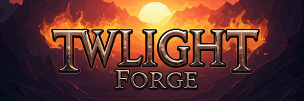

  

## 2D and 3D cross-platform game engine

[Twilight Forge](https://twilight.fifthcirclestudios.com) is a feature-rich, cross-platform game engine designed to streamline the creation of both 2D and 3D games from a unified interface. Building upon the foundation of Godot, Twilight Forge offers a comprehensive suite of [powerful tools](https://godotengine.org/features), enabling developers to focus on crafting unique games rather than reinventing the wheel.

With **Twilight Forge**, you can effortlessly export your games to a variety of platforms with just a single click. Whether targeting major desktop platforms (Linux, macOS, Windows), mobile platforms (Android, iOS), web-based platforms, or [console systems](https://docs.godotengine.org/en/latest/tutorials/platform/consoles.html), Twilight Forge makes cross-platform development seamless and efficient.

Leveraging the work of **Fifth Circle Studios**, we aim to further enhance the engine’s capabilities, bringing powerful features and optimizations to create a smoother, more dynamic game development experience. 

- NOTE: Currently all links still direct to Godot docs, an will remain that way till there is a big enough divergance to justify our own docs.

## UNDER CONSTRUCTION

